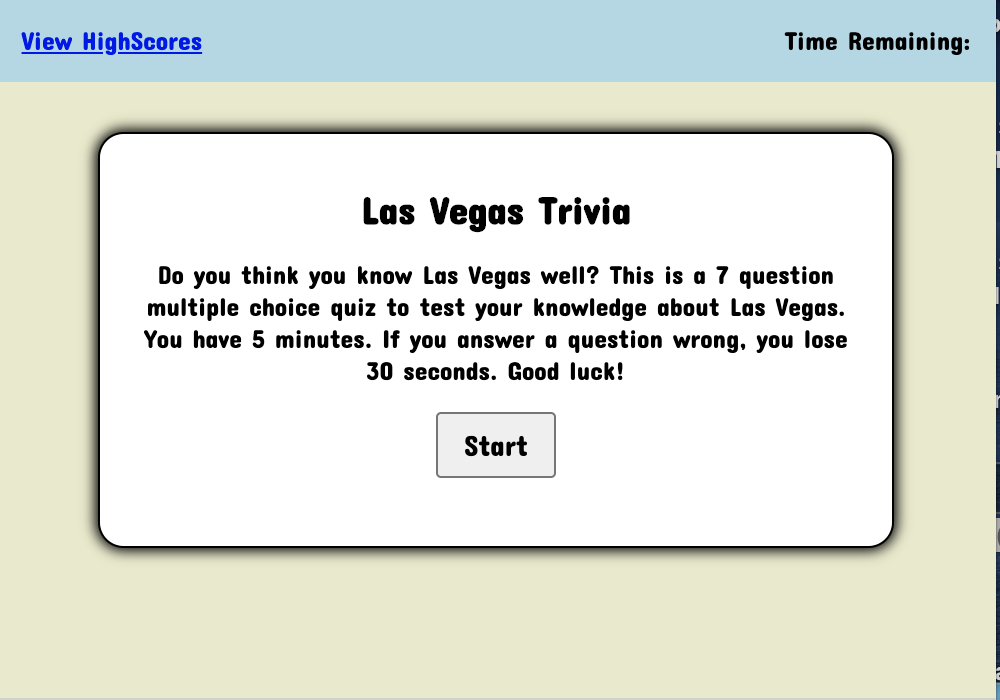

# javascript-quiz

Vegas quiz to test your knowledge!

## Description

This is a fun Vegas trivia quiz to test you about how well you know Vegas. This is a timed 5 minutes quiz to answer 7 questions. If you get a question wrong, 30 seconds are deducted from the clock. When you finish all of the questions or if time runs up, the quiz is over. You can enter your initials and your score will be saved in the local server.

## Technologies

- Javascript
- HTML
- CSS

## Installation

No installation necessary.

## Usage

Click start to begin the quiz. Click the button with what you think is the correct answer to choose your answer. Click "next" to go to the next question.

## Credits

David Anusontarangkul
[Github](https://github.com/anusontarangkul)
[LinkedIn](https://www.linkedin.com/in/anusontarangkul/)

This is part of a project for UC Berkeley Extension Fullstack Coding Bootcamp.

## License

Copyright <2020> <David Anusontarangkul>

Permission is hereby granted, free of charge, to any person obtaining a copy of this software and associated documentation files (the "Software"), to deal in the Software without restriction, including without limitation the rights to use, copy, modify, merge, publish, distribute, sublicense, and/or sell copies of the Software, and to permit persons to whom the Software is furnished to do so, subject to the following conditions:

The above copyright notice and this permission notice shall be included in all copies or substantial portions of the Software.

THE SOFTWARE IS PROVIDED "AS IS", WITHOUT WARRANTY OF ANY KIND, EXPRESS OR IMPLIED, INCLUDING BUT NOT LIMITED TO THE WARRANTIES OF MERCHANTABILITY, FITNESS FOR A PARTICULAR PURPOSE AND NONINFRINGEMENT. IN NO EVENT SHALL THE AUTHORS OR COPYRIGHT HOLDERS BE LIABLE FOR ANY CLAIM, DAMAGES OR OTHER LIABILITY, WHETHER IN AN ACTION OF CONTRACT, TORT OR OTHERWISE, ARISING FROM, OUT OF OR IN CONNECTION WITH THE SOFTWARE OR THE USE OR OTHER DEALINGS IN THE SOFTWARE.
